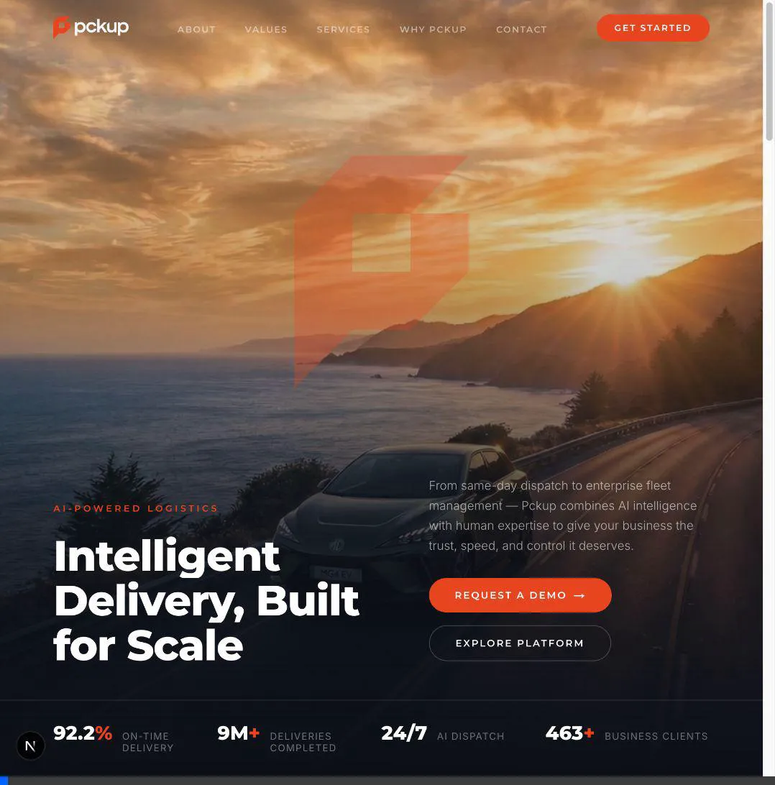
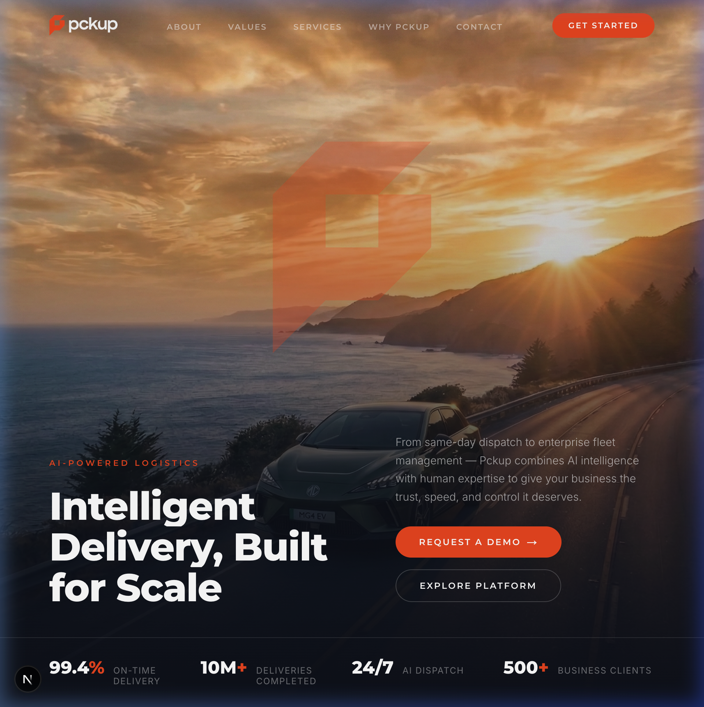
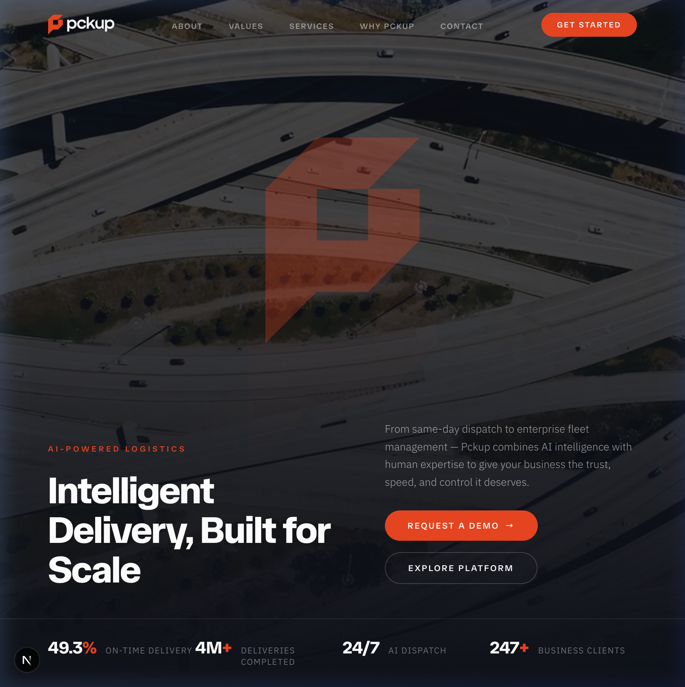
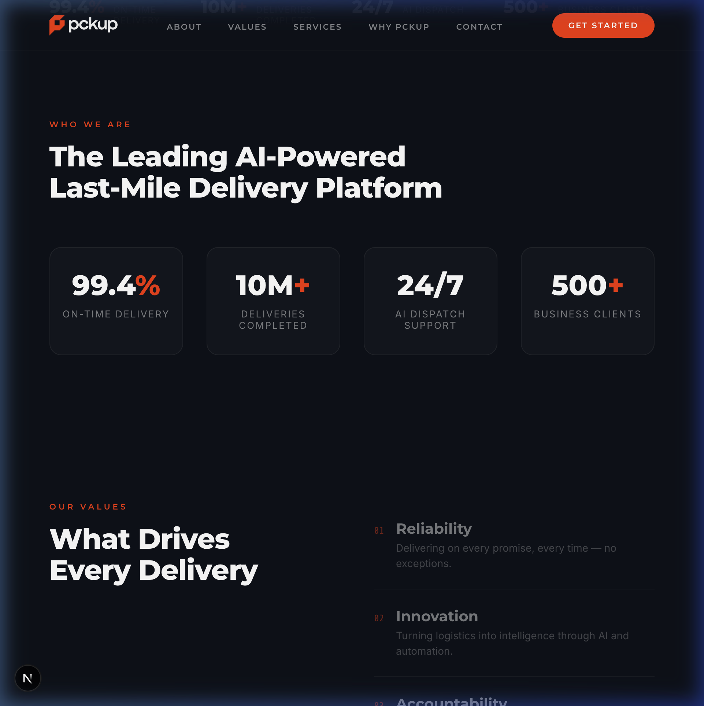
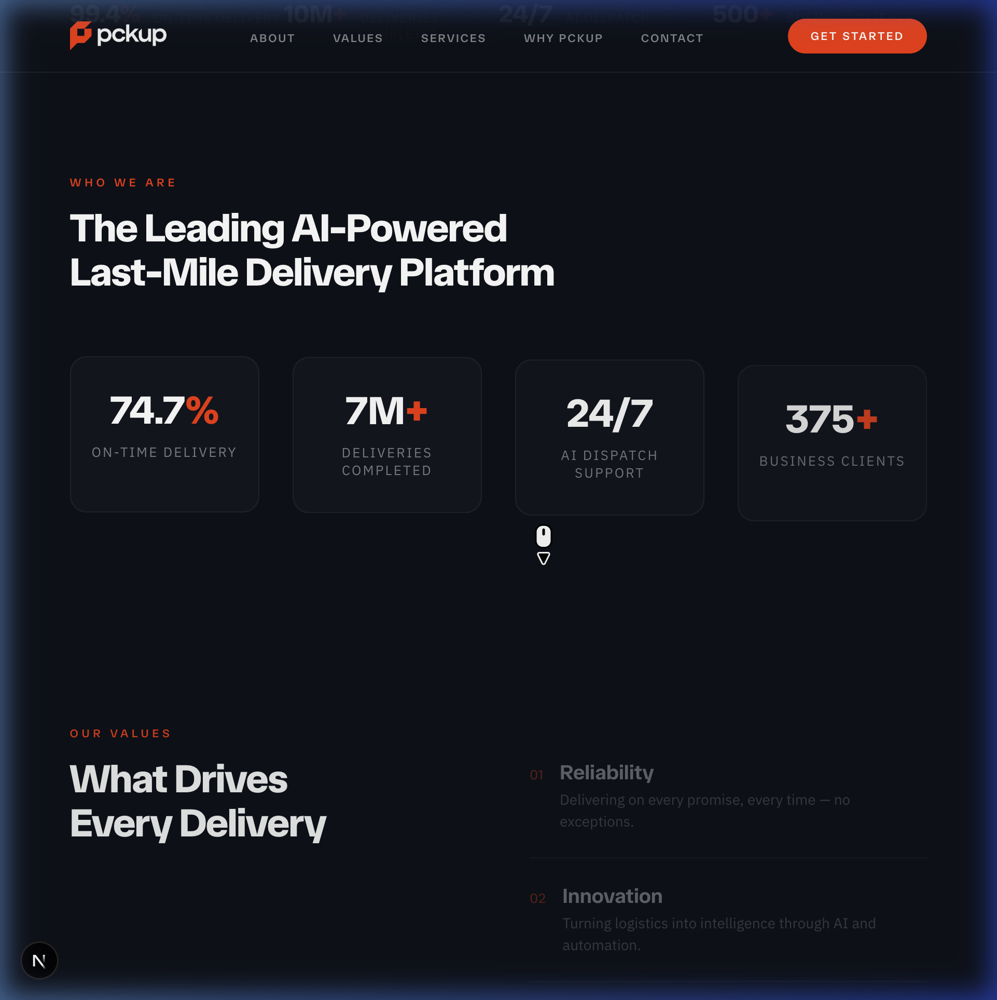
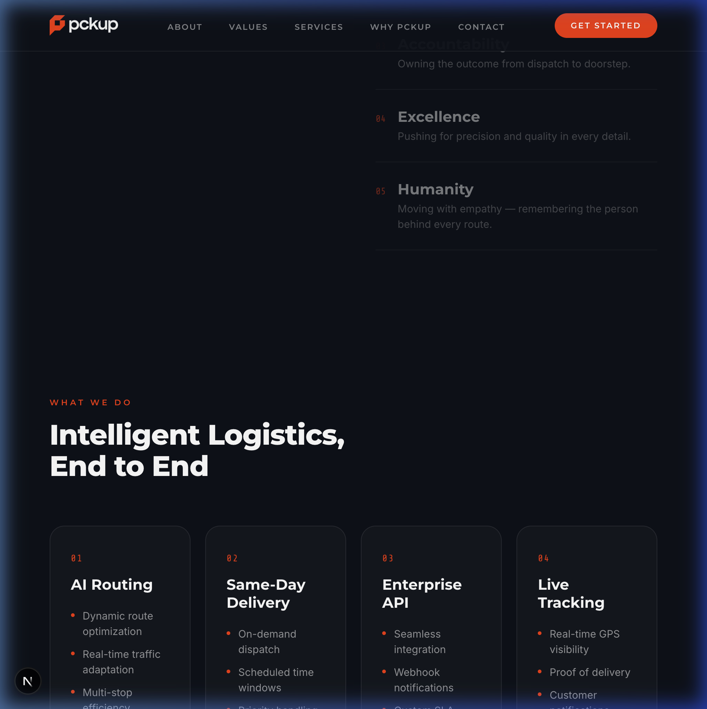
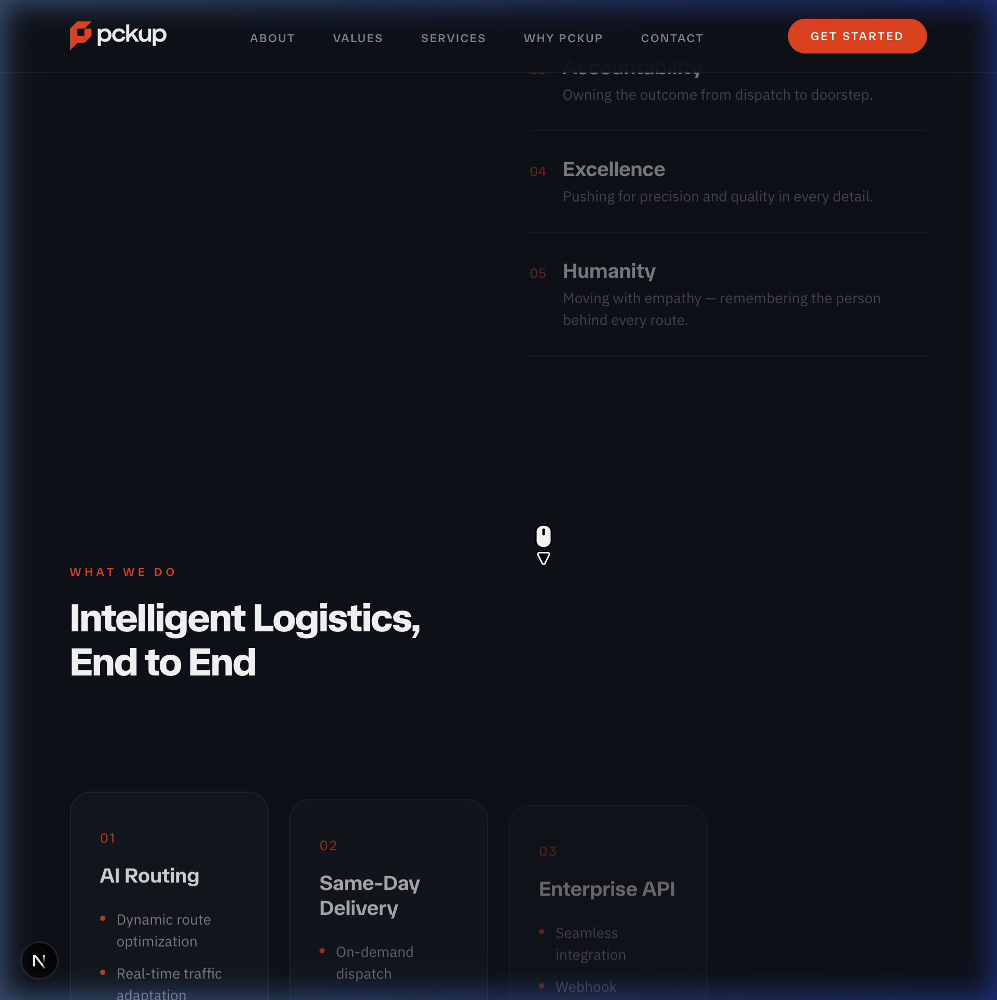
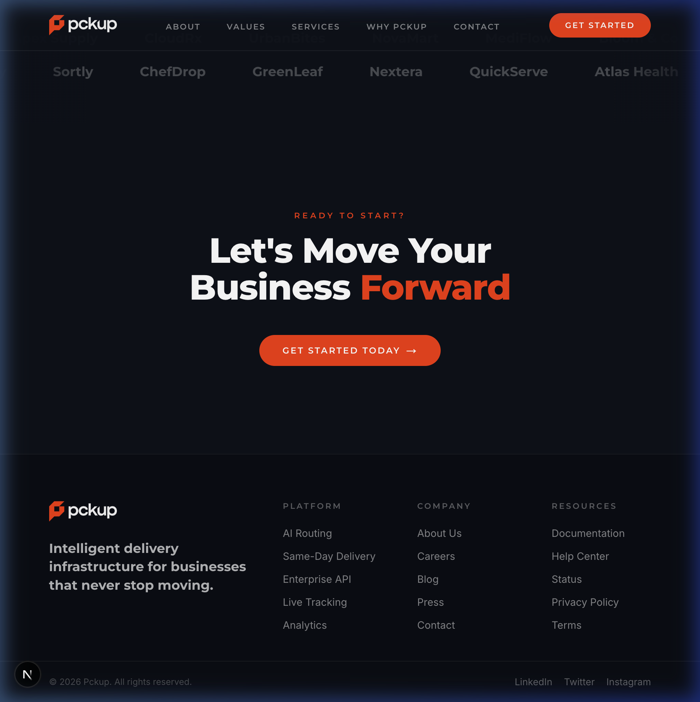
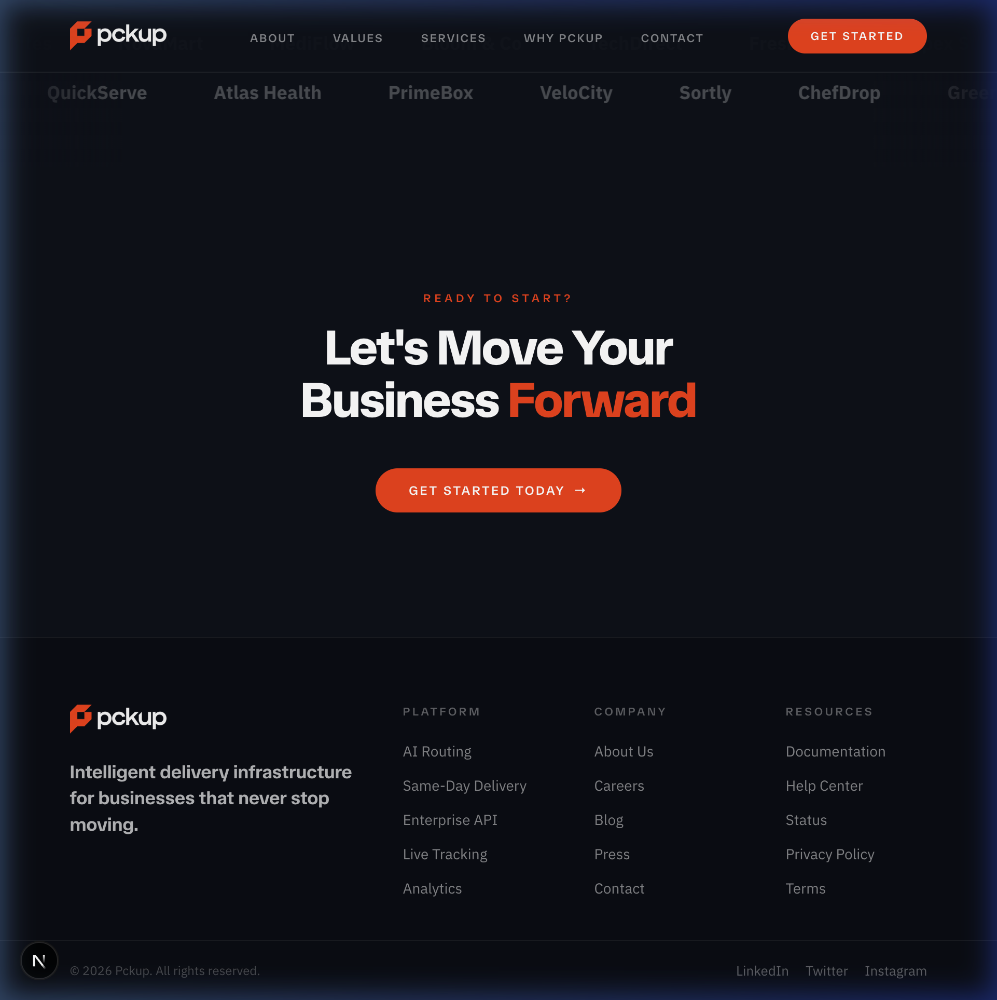

# Pckup — AI-Powered Last-Mile Delivery Landing Page

A modern, high-performance landing page for **Pckup**, an AI-powered last-mile delivery platform. Built with **Next.js 16**, **GSAP animations**, **Lenis smooth scrolling**, and **Swiper carousels**.

---

## 🚀 Getting Started

```bash
cd v6
npm install
npm run dev
```

Open [http://localhost:3000](http://localhost:3000) in your browser.

---

## 🔀 Branch Comparison: `main` vs `sean-edits`

The `sean-edits` branch introduces a refreshed visual identity with updated typography and a dynamic hero background. Below is a side-by-side comparison of both versions.

### Changes in `sean-edits`

| Change | `main` (Original) | `sean-edits` (Updated) |
|--------|-------------------|----------------------|
| **Headings & Display Font** | Montserrat | TASA Orbiter |
| **Body Text Font** | Inter | IBM Plex Sans |
| **Monospace / Accent Font** | Share Tech Mono | TASA Orbiter |
| **Hero Background** | Static image (sunset coastal road) | Looping video (highway interchange) |
| **Video Opacity** | N/A | 0.45 (subtle, cinematic) |

---

### 🎬 Preloader & Hero Animation

See the preloader animation, hero reveal, and background in action:

<table>
<tr>
<th>main (Original) — Static Background</th>
<th>sean-edits (Updated) — Video Background</th>
</tr>
<tr>
<td></td>
<td></td>
</tr>
</table>

**What to notice:**
- **Main**: Static sunset coastal road image behind the Pckup logo and hero text
- **Sean-edits**: Looping highway interchange video at 45% opacity creates a more dynamic, cinematic feel
- Both versions feature the same GSAP preloader animation, text reveal, and counter animations

---

### 🧭 Navigation Flow

Watch how the site navigates when clicking through the top menu (About → Values → Services → Why Pckup → Contact):

<table>
<tr>
<th>main (Original)</th>
<th>sean-edits (Updated)</th>
</tr>
<tr>
<td></td>
<td></td>
</tr>
</table>

**What to notice:**
- Both versions feature smooth Lenis-powered scroll navigation
- Typography differences are visible throughout: **Montserrat** vs **TASA Orbiter** for headings, **Inter** vs **IBM Plex Sans** for body text
- The fixed navbar transitions to a frosted glass effect when scrolled

---

### 🖼️ Static Screenshots

#### 🏠 Hero Section

<table>
<tr>
<th>main (Original)</th>
<th>sean-edits (Updated)</th>
</tr>
<tr>
<td></td>
<td></td>
</tr>
</table>

**Key Differences:**
- **Background**: Static sunset car image → looping highway interchange video at 45% opacity
- **Heading font**: Montserrat 800 → TASA Orbiter 800 (more geometric, space-inspired feel)
- **Body text**: Inter → IBM Plex Sans (crisper, more technical aesthetic)

---

#### 📊 Stats & Values Section

<table>
<tr>
<th>main (Original)</th>
<th>sean-edits (Updated)</th>
</tr>
<tr>
<td></td>
<td></td>
</tr>
</table>

**Key Differences:**
- Value names use TASA Orbiter instead of Montserrat
- Body descriptions use IBM Plex Sans instead of Inter
- Number accents use TASA Orbiter instead of Share Tech Mono

---

#### 🛠️ Services Section

<table>
<tr>
<th>main (Original)</th>
<th>sean-edits (Updated)</th>
</tr>
<tr>
<td></td>
<td></td>
</tr>
</table>

**Key Differences:**
- Section heading "Intelligent Logistics, End to End" in TASA Orbiter
- Service card titles (AI Routing, Same-Day Delivery, etc.) in TASA Orbiter
- Service card descriptions in IBM Plex Sans

---

#### 🦶 Footer Section

<table>
<tr>
<th>main (Original)</th>
<th>sean-edits (Updated)</th>
</tr>
<tr>
<td></td>
<td></td>
</tr>
</table>

**Key Differences:**
- CTA heading uses TASA Orbiter
- Footer column titles and brand tagline use TASA Orbiter
- Footer links use IBM Plex Sans

---

## 🎨 Typography

### `main` Branch
| Role | Font Family | Weights |
|------|-------------|---------|
| Headings & Display | Montserrat | 400, 600, 700, 800, 900 |
| Body Text | Inter | 300, 400, 500, 600 |
| Monospace Accents | Share Tech Mono | 400 |

### `sean-edits` Branch
| Role | Font Family | Weights |
|------|-------------|---------|
| Headings & Display | TASA Orbiter | 400, 500, 600, 700, 800 |
| Body Text | IBM Plex Sans | 300, 400, 500, 600, 700 |
| Accents & Numbers | TASA Orbiter | 400, 500, 600, 700, 800 |

---

## 🏗️ Tech Stack

- **Framework**: Next.js 16 (App Router, Turbopack)
- **Animations**: GSAP + ScrollTrigger
- **Smooth Scroll**: Lenis
- **Carousels**: Swiper
- **Text Splitting**: SplitType
- **Language**: TypeScript
- **Styling**: Vanilla CSS with CSS custom properties

---

## 📁 Project Structure

```
kouhei-pckup-landing-page/
├── v6/                          # Latest Next.js implementation
│   ├── app/
│   │   ├── components/          # React components
│   │   │   ├── Hero.tsx         # Hero section with video/image bg
│   │   │   ├── Navbar.tsx       # Fixed navigation bar
│   │   │   ├── Stats.tsx        # Statistics grid
│   │   │   ├── Values.tsx       # Interactive values list
│   │   │   ├── Services.tsx     # Service cards grid
│   │   │   ├── WhyPckup.tsx     # Three pillars section
│   │   │   ├── Testimonials.tsx # Swiper testimonial carousel
│   │   │   ├── Marquee.tsx      # Auto-scrolling logo marquee
│   │   │   ├── CTA.tsx          # Call-to-action section
│   │   │   ├── Footer.tsx       # Parallax-reveal footer
│   │   │   └── Preloader.tsx    # Animated preloader
│   │   ├── hooks/               # Custom React hooks
│   │   ├── globals.css          # All styles
│   │   ├── layout.tsx           # Root layout with font config
│   │   └── page.tsx             # Home page
│   └── public/                  # Static assets
├── screenshots/                 # Branch comparison media
│   ├── main/                    # Original design (screenshots + recordings)
│   └── sean-edits/              # Updated design (screenshots + recordings)
└── README.md                    # This file
```

---

## 📄 License

This project is private and proprietary.
